[README_PERFIL_ATUALIZADO.md](https://github.com/user-attachments/files/31384859/README_PERFIL_ATUALIZADO.md)
<!-- Banner topo -->

  

<!-- Badges de contato e redes -->

  

    

  

---

## 👨‍💻 Sobre Mim

Sou um desenvolvedor **Java** em constante evolução, construindo meu caminho no mundo da programação com foco em **backend**, **arquitetura de software** e **desenvolvimento full stack**.

> *"Transformo cada sessão de estudo em prática, cada prática em projeto, e cada projeto em prova de progresso."*

- 🎓 Estudante de Java, Programação Orientada a Objetos e Lógica de Programação
- 🚀 Construindo projetos práticos para consolidar conhecimento
- 📚 Explorando Spring Boot, APIs REST, bancos de dados e DevOps
- 🎯 Objetivo: migrar de exercícios para aplicações completas e profissionais

---

## 🛠️ Stack Tecnológica

### Backend

  
  
  
  
  

### Banco de Dados

  
  

### Ferramentas & DevOps

  
  
  
  
  

### Frontend

  
  
  

---

## 📊 GitHub Stats

  
  

  

---

## 🚀 Projetos em Destaque

### 🔴 [Pokédex Full Stack](https://github.com/GustavoBenAbraham/pokedex-fullstack)

API REST com Java Spring Boot + Frontend com JavaScript puro consumindo a PokeAPI.

---

### 📝 [Task Manager API](https://github.com/GustavoBenAbraham/task-manager-api)

API REST completa para gerenciamento de tarefas | Em desenvolvimento 🚧

&lt;/div&gt;

---

## 🏆 Projetos Concluídos

### 🔴 [Pokédex Full Stack](https://github.com/GustavoBenAbraham/pokedex-fullstack)
API REST com Java Spring Boot + Frontend com JavaScript puro consumindo a PokeAPI.

- ✅ Listagem paginada de Pokémons
- ✅ Busca por nome e ID
- ✅ Filtro por tipo (Fogo, Água, Planta, etc.)
- ✅ Modal de detalhes com estatísticas
- ✅ Design responsivo e animações

**Tecnologias:** Java 21, Spring Boot 4.1.1, HTML5, CSS3, JavaScript

---

## 📚 Roadmap de Aprendizado

```mermaid
graph LR
    A[Java Básico] --> B[POO]
    B --> C[Coleções & Streams]
    C --> D[Spring Boot]
    D --> E[JPA & Banco de Dados]
    E --> F[APIs REST]
    F --> G[Segurança JWT]
    G --> H[Testes]
    H --> I[Docker & CI/CD]
    I --> J[Microserviços]
    style A fill:#1e3a5f,color:#fff
    style D fill:#3b82f6,color:#fff
    style F fill:#3b82f6,color:#fff
    style I fill:#1e3a5f,color:#fff
```

- ✅ Java Básico & POO
- ✅ Git & GitHub
- ✅ Spring Boot & APIs REST
- ✅ Consumo de APIs externas (RestTemplate)
- ✅ Frontend com JavaScript puro
- 🔄 Testes automatizados *(em andamento)*
- ⏳ Docker & CI/CD
- ⏳ Segurança com JWT
- ⏳ Banco de dados PostgreSQL
- ⏳ Mensageria & Microsserviços

---

## 🎯 Conquistas & Destaques

- 📝 Criei um script de automação (.bat + Git) para versionar exercícios Java automaticamente
- 🐉 Desenvolvi uma **Pokédex Full Stack funcional** — API REST com Spring Boot + Frontend responsivo
- 🏗️ Construindo uma **API REST de Task Manager** com Spring Boot, documentação Swagger e containerização Docker
- 📖 Publicando meu aprendizado de forma pública e organizada

---

## 📫 Contato

---

  

<!--
Nota: Alguns badges e estatísticas são gerados dinamicamente por serviços externos.
Se algum não carregar, pode ser instabilidade temporária do serviço.
-->
